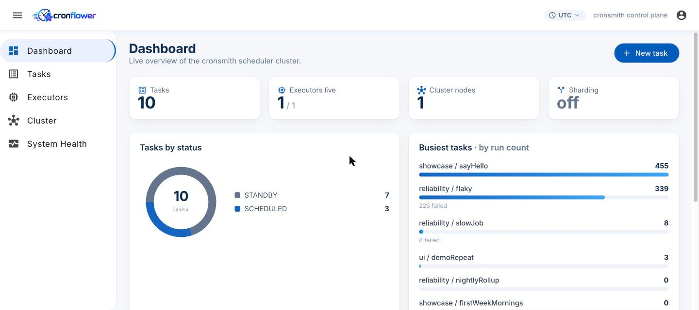
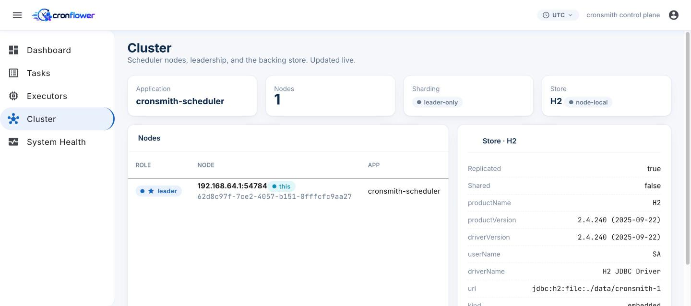
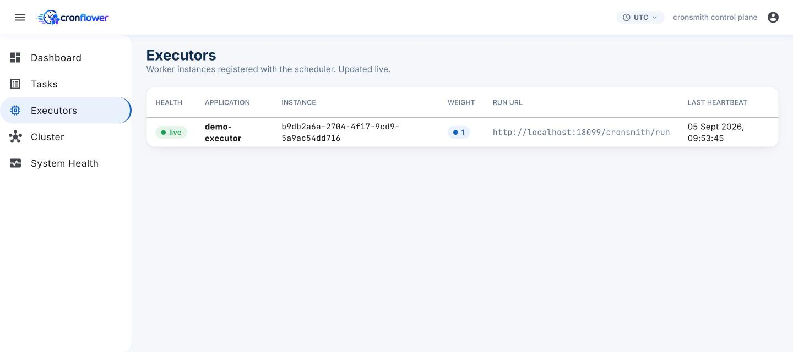
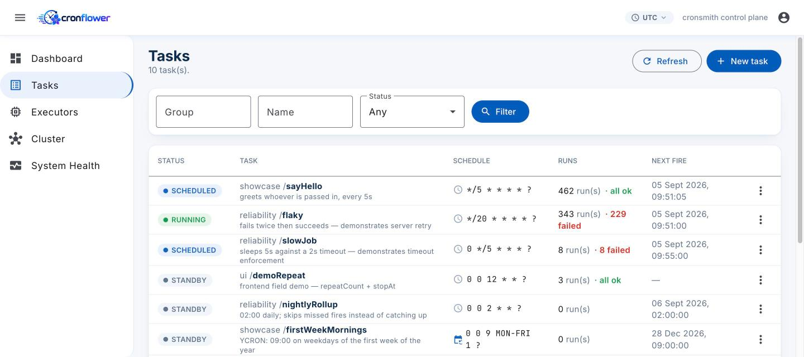
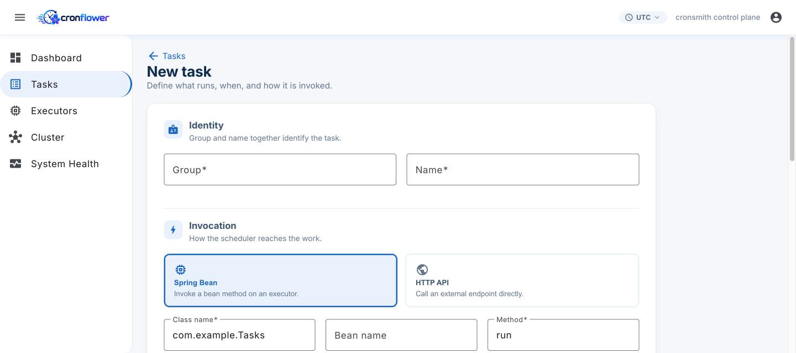
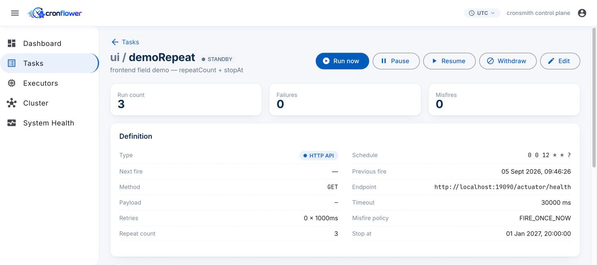
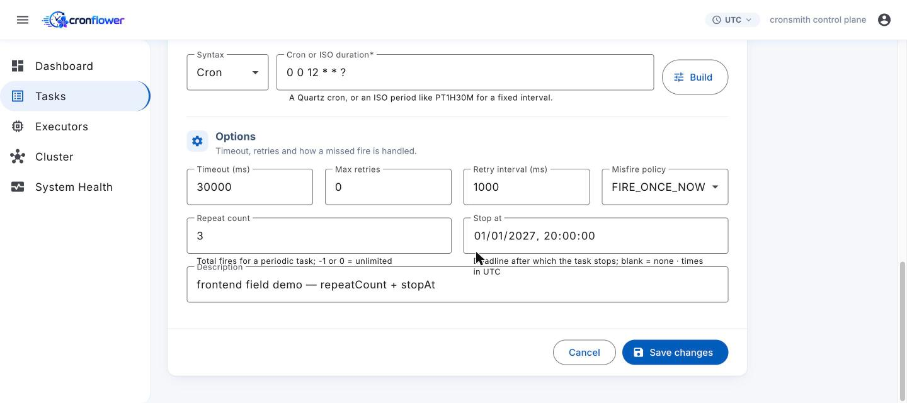
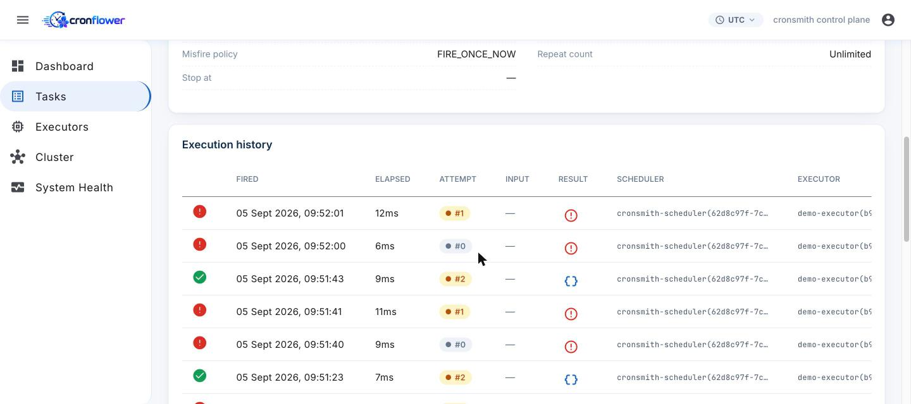
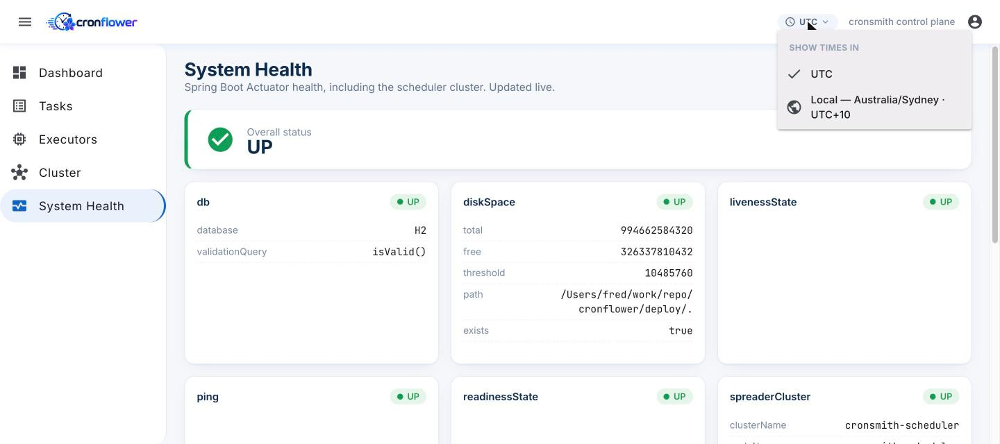
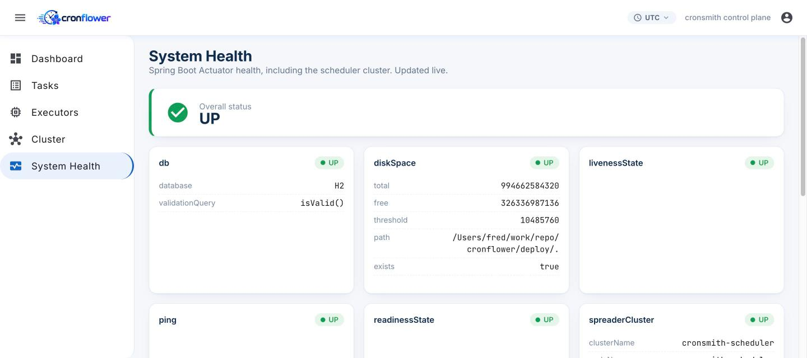

# cronsmith · cronflower


> **Run massive scheduled workloads on a cluster that forms itself — decentralized, and dependent on
> nothing external.** A distributed, stateful cron scheduler for the JVM: nodes gossip and elect a
> leader among themselves (no ZooKeeper/etcd), the store is embedded (no separate database required),
> and the console load-balances the cluster on its own (no nginx/KONG). Add a year-aware schedule
> syntax, an auto-detecting multi-database store, group sharding & weighted dispatch, and a
> first-class web console. Drop `@Task` on a Spring bean; the cluster owns the schedule and calls you back.

**cronsmith** is the engine and its Spring Boot starters. **cronflower** is the Angular operator
console and the monorepo that packages everything into a one-click, runnable demo — so you can go
from `git clone` to a live, **distributed** scheduler cluster with a UI in a single command:

- **Scales to massive task volumes** — a timing wheel drives large numbers of tasks; **group sharding**
  spreads them across nodes and **weighted dispatch** fans runs out to executors by capacity.
- **Self-clustering & decentralized** — every node is a peer that can become leader; membership and
  leadership are gossiped, not handed down by a central coordinator.
- **Zero external dependencies** — no separate database, message broker, coordination service, or load
  balancer to stand up. Embedded store, self-forming cluster, self-balancing console.



---

## Table of contents

- [Highlights](#highlights)
- [Tech stack](#tech-stack)
- [Architecture](#architecture)
- [Repository layout](#repository-layout)
- [Quickstart](#quickstart)
- [Creating & running tasks](#creating--running-tasks)
- [Time zones](#time-zones)
- [Configuration & production HA](#configuration--production-ha)
- [Documentation](#documentation)
- [License](#license)

## Highlights

- **Zero external infrastructure** — no separate database, message broker, or coordination service.
  The store is an embedded **H2** file and the cluster elects a leader on its own.
- **Truly distributed & HA** — nodes form a cluster (leader election via *openspreader*); the leader
  schedules and dispatches, followers fail over. No single point of failure.
- **Stateful & durable** — schedules and execution history live in a store that is **auto-detected**
  from the JDBC connection (in-memory → H2/SQLite → MySQL/PostgreSQL). Nothing to configure to switch.
- **Scales horizontally** — **group sharding** partitions work across nodes over a shared store;
  **weighted dispatch** sends runs to executors by capacity.
- **YCRON — year-based schedules** — express "the 200th day of the year" or "the first ISO week",
  which no traditional cron field can. Opt in per task; fully isolated from the classic parser.
- **Rich `@Task` model** — cron / YCRON / fixed-interval / ISO-8601 duration, plus retry with
  back-off, per-run timeout, misfire policy, and **repeat count / stop-at** limits — all declarative.
- **Fluent, self-validating schedules** — build cron with cronsmith's `CronBuilder`
  (`new CronBuilder().everyWeekday().at(9, 0)`) instead of error-prone hand-written strings, and drive
  a task's *entire* schedule from a `CronExpressionBuilder` bean computed at runtime.
- **Two invocation styles** — call a **Spring bean** method on an executor, or have the scheduler
  hit an **HTTP endpoint** directly. Both are first-class in the API and the console.
- **Operator console** — Dashboard, Tasks (create/edit with a live schedule builder), Executors,
  Cluster, and System Health — talking to a single endpoint, with a **UTC-first, per-viewer
  time-zone toggle**.

## Tech stack

| Layer | Stack |
|-------|-------|
| Engine | Java 17, an ANTLR 4 cron/YCRON grammar, a timing wheel, `openspreader` clustering |
| Starters | Spring Boot 4.1, Spring MVC, JPA/Hibernate + jOOQ storage tiers, Actuator |
| Stores | H2 · SQLite · MySQL · PostgreSQL (auto-detected) |
| Console | Angular 21 (standalone + signals), RxJS, Angular Material, Tailwind |
| Delivery | Maven Wrapper build · Docker / docker-compose · a zero-dependency Node static+proxy server |

## Architecture

```
   cronflower (Angular)  ──/cronsmith,/actuator──▶  scheduler cluster  ──dispatch──▶  executors
     Dashboard/Tasks/…                              scheduler-1 (leader)             @Task beans
                                                     scheduler-2/3 (followers)        :5xxxx (random)
                                                            │
                                              shared store (H2 · MySQL · PostgreSQL)
```

- The **scheduler** owns time: it parses the schedule, keeps the next-fire wheel, and dispatches due
  runs. The **leader** dispatches; **followers** stand by and take over on failure — the Cluster view
  shows who leads, the detected store, and whether sharding is on.



- An **executor** registers with the cluster, advertises the URL the scheduler calls back, and runs
  `@Task` bean methods. HTTP-API tasks are called by the scheduler directly, with no executor.



- The **store** holds task definitions and execution history. It is auto-detected from the JDBC URL,
  and the timestamps it records are **UTC**.

Full write-up, component responsibilities, and the persistence/serialization model:
[`docs/architecture.md`](docs/architecture.md).

## Repository layout

```
cronflower/
├── backend/                                   # Maven reactor (mvnw included — no system Maven needed)
│   ├── cronsmith-spring-boot-starter/             # scheduler (server) starter
│   ├── cronsmith-executor-spring-boot-starter/    # executor (client) starter
│   ├── cronsmith-scheduler-example/               # runnable scheduler — best-practice reference
│   └── cronsmith-executor-example/                # runnable executor — full @Task showcase
├── frontend/                                  # the cronflower Angular console
├── deploy/                                    # one-click runners (local + docker), Dockerfiles, web server
│   ├── run-local.sh   ·   run-docker.sh
│   ├── conf/scheduler.properties              # externalised advanced config (no rebuild)
│   └── bin/                                   # staged runnable jars (build output)
├── docs/                                      # architecture, configuration, screenshots
└── README.md
```

## Quickstart

**Nothing to provision** — no database, broker, or ZooKeeper/etcd. The store is an embedded **H2**
file and the nodes elect a leader themselves, so one command brings up a real *distributed* cluster
with a web console.

**Prerequisites:** JDK 17+ and Node 20+ (`npx` builds the console); Docker only for the container
path. The backend builds via the bundled **Maven Wrapper** — no system Maven.

### Local

```bash
git clone <this-repo>
cd cronflower/deploy
./run-local.sh -e 1          # scheduler + console + 1 executor  (embedded H2)
```

Open **<http://localhost:7200>**, sign in **admin / admin** — done.

```bash
./run-local.sh -n 3 -e 2     # scale up: 3 schedulers (leader + 2 followers) + 2 executors
./run-local.sh down          # stop everything the script started
```

### Docker

```bash
cd cronflower/deploy
./run-docker.sh -n 3 -e 2     # same, fully containerised
./run-docker.sh down
```

`-n` = scheduler nodes, `-e` = executor nodes. The store is **H2, zero-config**; for MySQL/PostgreSQL
just edit `deploy/conf/scheduler.properties` (no rebuild, no flag). More:
[`deploy/README.md`](deploy/README.md).

## Creating & running tasks

The console lists every task with its schedule, run counts, and next fire — browse, filter by group /
name / status, and drill into any one:



### Declare with `@Task`

Annotate a Spring bean method and the cluster owns the schedule:

```java
@Task(
    cron = "0 0 12 * * ?",          // Quartz cron — or interval / iso / a builder bean
    description = "daily rollup",
    maxRetryCount = 2,               // retry with back-off on failure
    retryInterval = 1000,
    timeout = 30_000,                // per-run timeout (ms)
    repeatCount = 30,                // finish after 30 fires (<= 0 = unlimited)
    misfirePolicy = MisfirePolicy.FIRE_ONCE_NOW)
public void nightlyRollup() { ... }
```

- **Schedule syntax** — classic `cron`, year-aware `ycron`, a fixed `interval`, an `iso` duration
  (e.g. `PT1H30M`), or a `builder` bean (see below).
- **Limits** — `repeatCount` finishes a periodic task after N fires; `stopAt` (builder-only, since it
  is a future instant) finishes it after a deadline. Either one, both, or neither.
- **Group** — blank defaults to the app's `spring.application.name` on Spring Boot, or `"default"`
  otherwise.

### Build schedules fluently — no hand-written cron

Point a task at a `CronExpressionBuilder` bean and build the schedule with cronsmith's fluent,
self-validating `CronBuilder` instead of error-prone cron strings. The builder can also supply the
parser, `repeatCount`, and a computed future `stopAt`; when `builder` is set it takes precedence over
the annotation's own `cron` / `parser`:

```java
@Bean
CronExpressionBuilder mondayMornings() {
    // constructed and validated in code — not a hand-typed "0 0 9 ? * MON" string
    return () -> new CronBuilder().everyWeek().Mon().at(9, 0).toString();
}

@Task(builder = "mondayMornings", description = "weekly report")
public void weeklyReport() { ... }
```

### Create & edit in the console

Choose **Spring Bean** or **HTTP API** (the scheduler calls the endpoint directly, no executor
needed) and set the schedule with a live builder:



### Inspect a task

Each task's page shows its full definition, including the periodic **repeat count** and **stop-at**:



### Edit a task

Editing re-opens the same form with every value filled in — periodic limits included:



### Watch runs & retries

Every run is recorded with its result, timing, attempt number (so retries are visible), and which
scheduler and executor handled it:



Full `@Task` cheatsheet and the REST API: [`docs/configuration.md`](docs/configuration.md).

## Time zones

The scheduler works entirely in **UTC** — every timestamp it stores and returns (next fire, previous
fire, execution logs, `stopAt`) is UTC. The console shows **UTC by default** so what you see always
matches what the cluster stored, and a one-click toggle in the top bar switches every time on screen —
and the datetime pickers in the task form — to the **viewer's local zone**. The choice is remembered
per browser.



## Configuration & production HA

Best-practice defaults ship in each example; tune the scheduler at deploy time (no rebuild) via
`deploy/conf/scheduler.properties`. Full key reference and the `@Task` cheatsheet:
[`docs/configuration.md`](docs/configuration.md).

Every node exposes Spring Boot Actuator health — including a `spreaderCluster` component — which the
console surfaces on the System Health page:



**Production HA — no external load balancer needed.** The web console (`deploy/web-server.mjs`)
bootstraps from **one** scheduler seed, discovers every node from the cluster roster, and
round-robins the API across them with automatic failover — so the UI survives any node failure
(the leader included), not just the data. Point it at a single seed and add nodes freely.

Prefer to front the cluster with **nginx / KONG / Envoy** anyway (TLS, a single ingress, NAT)? That
stays fully supported — load balancing remains the scheduler's job and the gateway is transparent
transport. See [Running behind nginx / KONG](docs/configuration.md#running-behind-nginx--kong).

## Documentation

- [`docs/architecture.md`](docs/architecture.md) — components, clustering, persistence & serialization
- [`docs/configuration.md`](docs/configuration.md) — full config keys and the `@Task` cheatsheet
- [`deploy/README.md`](deploy/README.md) — the local & Docker runners, flags, env overrides
- [`frontend/README.md`](frontend/README.md) — the console, dev proxy, and production `apiBaseUrl`

## License

See the `LICENSE` files in the backend modules.
