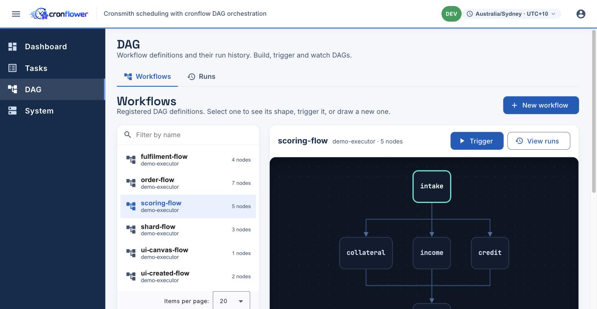
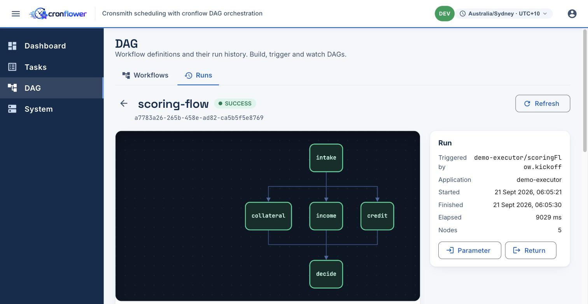
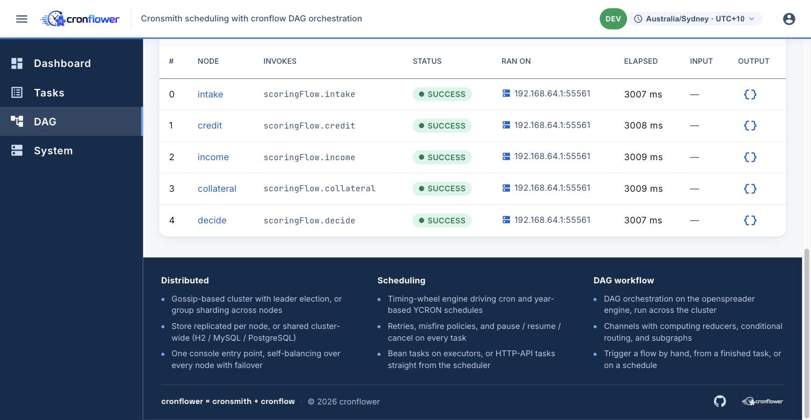

# Cronflower


**cronflower is an open-source, distributed cron scheduler for the JVM, with a web console, that
forms its own cluster and depends on nothing external.** Drop `@Task` on a Spring bean and the
cluster owns the schedule and calls you back; declare a `@Dag` and the same cluster runs a whole
workflow across your machines. One command takes you from `git clone` to a live, distributed
scheduler cluster with a UI, with no database, broker, or ZooKeeper/etcd to stand up.

cronflower brings two engines together under one console:

```
cronflower = cronsmith (distributed scheduling) + cronflow (DAG orchestration)
```


---

## Table of contents

- [Why](#why)
- [Tech stack](#tech-stack)
- [Architecture](#architecture)
- [Repository layout](#repository-layout)
- [Quickstart](#quickstart)
- [Distributed task scheduling](#distributed-task-scheduling)
- [DAG workflow orchestration](#dag-workflow-orchestration)
- [Installation](#installation)
- [Time zones](#time-zones)
- [Configuration & production HA](#configuration--production-ha)
- [Documentation](#documentation)
- [License](#license)

## Why

`@Scheduled` runs in one JVM, so it fires twice the moment you scale out, and it has no retry, no
timeout, no history, and no view of what ran. The usual fix is to bolt on Quartz, a database, a lock
table, and a dashboard you wrote yourself. cronsmith is that whole stack behind two dependencies:

- **Zero external infrastructure** — no separate database, message broker, or coordination service.
  The store is an embedded **H2** file and the cluster elects a leader on its own.
- **Truly distributed & HA** — nodes form a cluster (leader election via *openspreader*); the leader
  schedules and dispatches, followers fail over. No single point of failure, no cron fired twice.
- **Stateful & durable** — schedules and execution history live in a store **auto-detected** from the
  JDBC connection (in-memory → H2/SQLite → MySQL/PostgreSQL). Nothing to configure to switch.
- **Scales horizontally** — a timing wheel drives large task volumes; **group sharding** partitions
  work across nodes over a shared store and **weighted dispatch** fans runs out to executors by capacity.
- **Rich `@Task` model** — cron / YCRON / fixed-interval / ISO-8601 duration, plus retry with
  back-off, per-run timeout, misfire policy, and repeat-count / stop-at limits, all declarative.
- **YCRON — year-based schedules** — express "the 200th day of the year", which no traditional cron
  field can. Opt in per task; fully isolated from the classic parser.
- **DAG orchestration (cronflow)** — declare a workflow of `@Dag` nodes with typed channels,
  branching, joins, subgraphs, and dynamic fan-out; the cluster drives the graph across executors.
- **Operator console** — Tasks, Executors, Cluster, DAG workflows & runs, and System Health, all
  talking to a single endpoint, with a **UTC-first, per-viewer time-zone toggle**.

## Tech stack

| Layer | Stack |
|-------|-------|
| Engine | Java 17, an ANTLR 4 cron/YCRON grammar, a timing wheel, `openspreader` clustering |
| Starters | Spring Boot 4.1, Spring MVC, JPA/Hibernate + jOOQ storage tiers, Actuator |
| Stores | H2 · SQLite · MySQL · PostgreSQL (auto-detected) |
| Console | Angular 21 (standalone + signals), RxJS, Angular Material, cytoscape (DAG graph) |
| Delivery | Maven Wrapper build · Docker / docker-compose · a zero-dependency Node static+proxy server |

## Architecture

```
   cronflower (Angular)  ──/cronsmith,/cronflow,/actuator──▶  scheduler cluster  ──dispatch──▶  executors
     Tasks/Cluster/DAG/…                                       scheduler-1 (leader)             @Task / @Dag beans
                                                               scheduler-2/3 (followers)        :5xxxx (random)
                                                                       │
                                                          shared store (H2 · MySQL · PostgreSQL)
```

- The **scheduler** owns time: it parses the schedule, keeps the next-fire wheel, and dispatches due
  runs. The **leader** dispatches; **followers** stand by and take over on failure. The Cluster view
  shows who leads, the detected store, and whether sharding is on.


- An **executor** registers with the cluster, advertises the URL the scheduler calls back, heartbeats,
  and runs `@Task` and `@Dag` bean methods. HTTP-API tasks are called by the scheduler directly, with
  no executor.


Full write-up, component responsibilities, and the persistence/serialization model:
[`docs/architecture.md`](docs/architecture.md).

## Repository layout

```
cronflower/
├── backend/                                   # Maven reactor (mvnw included — no system Maven needed)
│   ├── cronsmith-spring-boot-starter/             # scheduler (server) starter
│   ├── cronsmith-executor-spring-boot-starter/    # executor (client) starter
│   ├── cronflow-spring-boot-starter/              # DAG (server) starter — optional add-on
│   ├── cronflow-executor-spring-boot-starter/     # DAG (executor) starter — optional add-on
│   ├── cronflow-server-api/                       # runnable scheduler (cronsmith + optional cronflow)
│   └── cronflow-executor-example/                 # runnable executor (@Task showcase + example DAGs)
├── frontend/                                  # the cronflower Angular console
├── deploy/                                    # one-click runners (local + docker), Dockerfiles, web server
│   ├── run-local.sh   ·   run-docker.sh
│   ├── conf/server.properties                     # externalised advanced config (no rebuild)
│   └── bin/                                        # staged runnable jars (build output)
├── docs/                                      # architecture, configuration, screenshots
└── README.md
```

## Quickstart

**Nothing to provision** — no database, broker, or ZooKeeper/etcd. The store is an embedded **H2**
file and the nodes elect a leader themselves, so one command brings up a real *distributed* cluster
with a web console.

**Prerequisites:** JDK 17+ and Node 20+ (`npx` builds the console); Docker only for the container
path. The backend builds via the bundled **Maven Wrapper** — no system Maven.

### Local

```bash
git clone <this-repo>
cd cronflower/deploy
./run-local.sh -e 1          # scheduler + console + 1 executor  (embedded H2)
```

Open **<http://localhost:7200>**, sign in **admin / admin123** — done.

```bash
./run-local.sh -n 3 -e 2     # scale up: 3 schedulers (leader + 2 followers) + 2 executors
./run-local.sh down          # stop everything the script started
```

### Docker

```bash
cd cronflower/deploy
./run-docker.sh -n 3 -e 2     # same, fully containerised
./run-docker.sh down
```

`-n` = scheduler nodes, `-e` = executor nodes. The store is **H2, zero-config**; for MySQL/PostgreSQL
just edit `deploy/conf/server.properties` (no rebuild, no flag). More:
[`deploy/README.md`](deploy/README.md).

## Distributed task scheduling

There are two kinds of process: a **scheduler** owns the schedule (keeps state in a store, decides
when each task is due, and calls out to run it), and an **executor** is your application, which
declares tasks with `@Task` and runs the code when the scheduler says it's time. Run several
schedulers and they elect a leader over gossip; state lives in the store, so a restart or failover
loses nothing.

### Declare with `@Task`

Annotate a Spring bean method on an executor and the cluster owns the schedule from startup:

```java
@Component
public class DemoTasks {

    // classic cron, retried with back-off, timed out per run, finishing after 30 fires
    @Task(cron = "0 0 12 * * ?", group = "showcase", name = "nightlyRollup",
          maxRetryCount = 2, retryInterval = 1000, timeout = 30_000, repeatCount = 30,
          misfirePolicy = MisfirePolicy.FIRE_ONCE_NOW)
    public void nightlyRollup() { ... }

    // a String parameter, constant or a SpEL template evaluated fresh on every fire
    @Task(cron = "0 0 * * * ?", group = "showcase", name = "heartbeatTick",
          initialParameter = "#{T(java.time.LocalDate).now().toString()}")
    public void heartbeatTick(String today) { ... }

    // a schedule the month-based grammar can't say: noon on the 200th day of the year
    @Task(cron = "0 0 12 ? ? 200", parser = "ycron", group = "showcase", name = "dayOfYear200")
    public void dayOfYear200() { ... }
}
```

| Attribute | What it does |
|-----------|--------------|
| `cron` / `parser` | a cron schedule, or YCRON with `parser = "ycron"` |
| `interval` + `intervalUnit` | a fixed interval, e.g. every 10 seconds |
| `iso` | a fixed interval as an ISO-8601 duration, e.g. `PT1H30M` |
| `builder` | a `CronExpressionBuilder` bean that builds the schedule in code (takes precedence over `cron`) |
| `initialParameter` | a constant, or a SpEL template evaluated on each fire |
| `group` / `name` / `description` | identity, and the label the console shows |
| `maxRetryCount` / `retryInterval` | retry a failed run, with back-off |
| `timeout` | fail a run that overruns, in milliseconds |
| `misfirePolicy` | `FIRE_ONCE_NOW` (default) / `FIRE_ALL` / `SKIP` |
| `repeatCount` / `stopAt` | finish after N fires, or after a deadline |

### Build schedules fluently — no hand-written cron

Point a task at a `CronExpressionBuilder` bean and build the schedule with cronsmith's fluent,
self-validating `CronBuilder` instead of an error-prone string:

```java
@Bean
CronExpressionBuilder mondayMornings() {
    return () -> new CronBuilder().everyWeek().Mon().at(9, 0).toString();
}

@Task(builder = "mondayMornings", description = "weekly report")
public void weeklyReport() { ... }
```

### Tasks without an executor, and operating them

Some jobs are just "call this URL on a schedule". Create an **HTTP-API task** from the console's
*New task* form or the REST API and the scheduler makes the call itself, no executor involved, which
is also how an operator adds or edits any task without a redeploy. Every task can be run once now,
paused, resumed, or canceled, over the console or the REST API.

Every run is recorded with its result, timing, and attempt number (so retries are visible), plus
which scheduler dispatched it and which executor ran it:


## DAG workflow orchestration

Plain cron schedules single jobs; it can't orchestrate a flow of them. **cronflow** (the optional
add-on) lets you declare the steps and how they depend on each other as a graph, and the same cluster
runs the graph node by node, with data flowing between nodes over typed channels.

A DAG is a Spring bean: `@Dag` names it, each `@DagNode` method is a step, and the `to` list is the
edges. Nodes hand data to each other by returning a `Map` of named channel writes and read upstream
values from the `DagState`; a `@Channel` says how concurrent writes to it are merged by a reducer:

```java
@Dag(name = "scoring-flow", inputs = {"input"}, channels = {
        @Channel(name = "score",   reducer = ChannelReducer.SUM_INT),
        @Channel(name = "factors", reducer = ChannelReducer.JOIN_CSV)})
@Component
public class ScoringFlow {

    @DagNode(entry = true, to = {"credit", "income", "collateral"})   // fan out to 3 parallel scorers
    public Map<String, Object> intake(DagState state) {
        return Map.of("applicant", state.getString("input"));
    }

    @DagNode(to = {"decide"})
    public Map<String, Object> credit(DagState state) {
        return Map.of("score", 40, "factors", "credit");
    }
    // income(), collateral() … same shape, writing to the same channels

    @DagNode(trigger = "ALL")                                         // join: wait for all three
    public Map<String, Object> decide(DagState state) {
        long total = state.getLong("score");                         // reducer already summed them
        return Map.of("decision", total >= 70 ? "APPROVED" : "REJECTED");
    }
}
```

The console renders exactly what you declared, so you see the shape before you run it:



The edges aren't just straight lines: `when = @When(expr = "#risk > 80", to = "review")` routes by a
SpEL expression, `trigger = "ANY"` joins on the first arrival, `subgraph = "..."` nests a whole other
DAG, and `@Shard(input, output)` fans a node out once per list element at run time. Reducers cover
the usual merges (`SUM_INT`, `MAX`/`MIN`, `AND`/`OR`, `CONCAT_LIST`, `MERGE_MAP`, `JOIN_CSV`, …), or
point a channel at your own bean with `customReducer`.

A workflow starts three ways: **by hand** from the console (with an optional JSON seed), **from a
finished `@Task`** whose return value becomes the DAG input, or **on a schedule directly** by picking
*Trigger DAG* in the *Create Task* form.

A run is not a black box. Open it and the graph lights up node by node, with a panel showing what
triggered it and how long it took:



Below the graph each node is a row showing what it invoked, its result, its timing, and crucially
**which executor ran it** — the engine drives the graph across the whole cluster and dispatches each
node to a live executor, so a wide fan-out really runs in parallel on different machines:



## Installation

Two starters cover scheduling; two more add the DAG orchestrator. All are Spring Boot auto-configured.

**Scheduler** (runs the cluster, needs a datasource):

```xml
<dependency>
    <groupId>com.github.paganini2008</groupId>
    <artifactId>cronsmith-spring-boot-starter</artifactId>
    <version>1.0.0-SNAPSHOT</version>
</dependency>
```

**Executor** (your app, declares `@Task` beans and points at the scheduler):

```xml
<dependency>
    <groupId>com.github.paganini2008</groupId>
    <artifactId>cronsmith-executor-spring-boot-starter</artifactId>
    <version>1.0.0-SNAPSHOT</version>
</dependency>
```

```properties
spring.application.name=orders-worker
cronsmith.client.server-urls=http://scheduler-1:8080,http://scheduler-2:8080
```

**DAG add-on** (optional): add `cronflow-spring-boot-starter` on the scheduler and
`cronflow-executor-spring-boot-starter` on the executor that hosts your `@Dag` beans, pointed with
`cronflow.client.server-urls`. Start it, declare a `@Dag`, and it appears in the console ready to run.

## Time zones

The scheduler works entirely in **UTC** — every timestamp it stores and returns (next fire, previous
fire, execution logs, `stopAt`) is UTC, computed in `cronsmith.server.scheduler.zone` (UTC by
default), which must match across nodes. The console shows **UTC by default** so what you see matches
what the cluster stored, and a one-click toggle in the top bar switches every time on screen, and the
task form's datetime pickers, to the **viewer's local zone**. The choice is remembered per browser.

## Configuration & production HA

Best-practice defaults ship in each example; tune the scheduler at deploy time (no rebuild) via
`deploy/conf/server.properties`. Full key reference and the `@Task` cheatsheet:
[`docs/configuration.md`](docs/configuration.md).

- **Store** is auto-detected from the datasource. A **node-local** store (per-node H2/SQLite) is kept
  in sync by the leader; a **shared** database (MySQL/PostgreSQL) additionally unlocks **group
  sharding** (`cronsmith.server.scheduler.sharding`, on by default), where every node fires only the
  task groups that hash to it. On a node-local store it safely stays leader-only.
- **Dispatch routing** across an app's executors is round-robin by default; switch it with
  `cronsmith.server.dispatch.routing` to `WEIGHTED`, `CONSISTENT_HASH`, `RANDOM`, `FIRST` or `LAST`.
- **Scale** — the leader loads only tasks due in the next `window-minutes` into the wheel and claims
  the rest from the store as they come due, so a cluster with hundreds of thousands of tasks still
  starts instantly.
- **Monitoring** — every node exposes Actuator health (including a `spreaderCluster` component) and a
  Prometheus scrape endpoint (`/actuator/health`, `/actuator/prometheus`), surfaced on the console's
  System Health page.

**No external load balancer needed.** The web console (`deploy/web-server.mjs`) bootstraps from
**one** scheduler seed, discovers every node from the cluster roster, and round-robins the API across
them with automatic failover, so the UI survives any node failure (the leader included), not just the
data. Prefer to front the cluster with **nginx / KONG / Envoy** anyway (TLS, single ingress, NAT)?
That stays fully supported — load balancing remains the scheduler's job and the gateway is transparent
transport. See [Running behind nginx / KONG](docs/configuration.md#running-behind-nginx--kong).

## Documentation

- [`docs/architecture.md`](docs/architecture.md) — components, clustering, persistence & serialization
- [`docs/configuration.md`](docs/configuration.md) — full config keys and the `@Task` cheatsheet
- [`deploy/README.md`](deploy/README.md) — the local & Docker runners, flags, env overrides
- [`frontend/README.md`](frontend/README.md) — the console, dev proxy, and production `apiBaseUrl`

## License

Licensed under the Apache License 2.0. See the `LICENSE` file.
