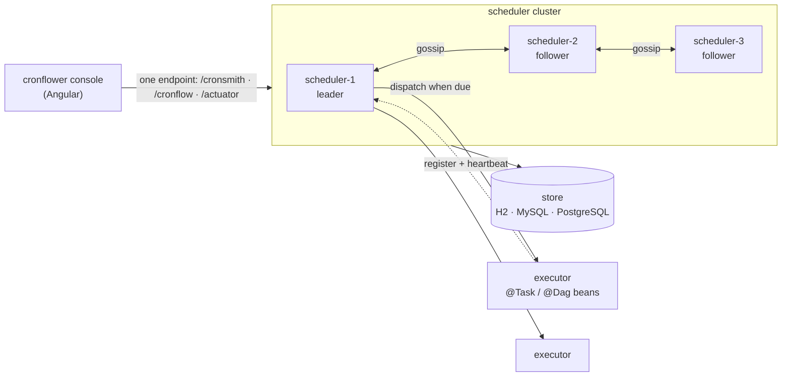

# cronflower


**Distributed cron for the JVM, with a console — it clusters itself and depends on nothing external.**

Drop `@Task` on a Spring bean and the cluster owns the schedule and calls you back; declare a `@Dag`
and the same cluster runs a whole workflow across your machines. One command takes you from `git clone`
to a live, distributed scheduler cluster with a UI — no database, broker, or ZooKeeper/etcd to stand up.

```
cronflower = cronsmith (distributed scheduling) + cronflow (DAG orchestration)
```


## Features

Replacing `@Scheduled` + Quartz + a database + a lock table + a hand-rolled dashboard with two
dependencies:

| Capability | What it gives you |
|------------|-------------------|
| **Zero external infrastructure** | No separate database, broker, or coordination service — embedded H2 store, self-forming cluster, self-balancing console |
| **Distributed & HA** | Gossip leader election (via *openspreader*); followers fail over; no cron fires twice, none goes missing |
| **Stateful & durable** | Schedules + history in a store **auto-detected** from the JDBC URL (in-memory → H2/SQLite → MySQL/PostgreSQL); a restart or failover loses nothing |
| **Scales horizontally** | A timing wheel drives large task volumes; **group sharding** spreads them across nodes; **weighted dispatch** fans runs out to executors by capacity |
| **Rich `@Task` model** | cron / YCRON / fixed-interval / ISO-8601 duration, plus retry with back-off, per-run timeout, misfire policy, and repeat / stop-at limits — all declarative |
| **YCRON** | Year-based schedules ("the 200th day of the year") that no traditional cron field can express |
| **DAG orchestration** | `@Dag` graphs with typed channels, branching, joins, subgraphs, and dynamic fan-out, driven across the cluster |
| **Operator console** | Tasks, Executors, Cluster, DAG runs, System Health, and a live Settings view — one endpoint, UTC-first with a per-viewer time-zone toggle |

## How it works


```mermaid
flowchart LR
  Console["cronflower console<br/>(Angular)"] -->|"one endpoint: /cronsmith · /cronflow · /actuator"| Cluster
  subgraph Cluster["scheduler cluster"]
    L["scheduler-1<br/>leader"] <-->|gossip| F1["scheduler-2<br/>follower"]
    F1 <-->|gossip| F2["scheduler-3<br/>follower"]
  end
  Cluster --> Store[("store<br/>H2 · MySQL · PostgreSQL")]
  L -->|"dispatch when due"| E1["executor<br/>@Task / @Dag beans"]
  L --> E2["executor"]
  E1 -.->|register + heartbeat| L
```

- The **scheduler** owns time: it parses schedules, keeps the next-fire wheel, and dispatches due runs. The **leader** dispatches; **followers** take over on failure.
- An **executor** is your app: it registers `@Task` / `@Dag` beans on boot and runs them on callback. HTTP-API tasks run on the scheduler itself, with no executor.

Deeper dive, with diagrams: [`docs/architecture.md`](docs/architecture.md).

## Requirements

| Need | Version / note |
|------|----------------|
| JDK | 17+ (backend builds via the bundled **Maven Wrapper** — no system Maven) |
| Node | 20+ (`npx` builds the Angular console) |
| Docker | optional — only for the container path |
| Database | optional — none → embedded **H2**; point at **MySQL / PostgreSQL** for a shared store |

No message broker, no ZooKeeper / etcd, no external load balancer.

## Quick Start

**Nothing to provision.** The store is an embedded H2 file and the nodes elect a leader themselves, so
one command brings up a real *distributed* cluster with a console.

```bash
git clone https://github.com/paganini2008/cronflower
cd cronflower/deploy
./run-local.sh -e 1          # scheduler + console + 1 executor  (embedded H2)
```

**Expected:** open <http://localhost:7200>, sign in **admin / admin123** — you land on the dashboard
with the example tasks already scheduled.

```bash
./run-local.sh -n 3 -e 2     # scale up: 3 schedulers (leader + 2 followers) + 2 executors
./run-local.sh down          # stop everything the script started
./run-docker.sh -n 3 -e 2    # same, fully containerised  (./run-docker.sh down to stop)
```

`-n` = scheduler nodes, `-e` = executor nodes. More: [`deploy/README.md`](deploy/README.md).

## Examples

### Schedule a method — `@Task`  *(on an executor)*

```java
@Component
public class DemoTasks {

    // classic cron, retried with back-off, timed out per run, finishing after 30 fires
    @Task(cron = "0 0 12 * * ?", group = "showcase", name = "nightlyRollup",
          maxRetryCount = 2, retryInterval = 1000, timeout = 30_000, repeatCount = 30,
          misfirePolicy = "FIRE_ONCE_NOW")
    public void nightlyRollup() { /* ... */ }

    // SpEL parameter, evaluated fresh on every fire
    @Task(cron = "0 0 * * * ?", group = "showcase", name = "heartbeatTick",
          initialParameter = "#{T(java.time.LocalDate).now().toString()}")
    public void heartbeatTick(String today) { /* ... */ }

    // YCRON: noon on the 200th day of the year — no classic cron can say this
    @Task(cron = "0 0 12 ? ? 200", parser = "ycron", group = "showcase", name = "dayOfYear200")
    public void dayOfYear200() { /* ... */ }
}
```

**Output:** each method appears in the console with its schedule, run count, and next fire; every run
is recorded with result, timing, attempt number, and which scheduler/executor handled it.


### Build a schedule in code — `CronExpressionBuilder`

```java
@Bean
CronExpressionBuilder mondayMornings() {
    return () -> new CronBuilder().everyWeek().Mon().at(9, 0).toString();  // validated in code
}

@Task(builder = "mondayMornings", description = "weekly report")
public void weeklyReport() { /* ... */ }
```

### Tasks without an executor — HTTP-API task

Some jobs are just "call this URL on a schedule". Create one from the console's *New task* form or the
REST API; the scheduler makes the call itself, no executor involved (and operators add/edit tasks with
no redeploy). Every task can be run-now / paused / resumed / canceled from the console or REST API.

### Orchestrate steps — `@Dag`  *(cronflow add-on)*

```java
@Dag(name = "scoring-flow", inputs = {"input"}, channels = {
        @Channel(name = "score",   reducer = ChannelReducer.SUM_INT),
        @Channel(name = "factors", reducer = ChannelReducer.JOIN_CSV)})
@Component
public class ScoringFlow {

    @DagNode(entry = true, to = {"credit", "income", "collateral"})     // fan out to 3 parallel scorers
    public Map<String, Object> intake(DagState state) {
        return Map.of("applicant", state.getString("input"));
    }

    @DagNode(to = {"decide"})
    public Map<String, Object> credit(DagState state) {
        return Map.of("score", 40, "factors", "credit");
    }
    // income(), collateral() … same shape, writing to the same channels

    @DagNode(trigger = "ALL")                                           // join: wait for all three
    public Map<String, Object> decide(DagState state) {
        long total = state.getLong("score");                           // reducer already summed them
        return Map.of("decision", total >= 70 ? "APPROVED" : "REJECTED");
    }
}
```

Branching (`when` + SpEL), join modes (`trigger = ALL/ANY`), nesting (`subgraph`), and dynamic fan-out
(`@Shard`) are all annotation attributes; concurrent channel writes merge through a reducer
(`SUM_INT`, `MAX`/`MIN`, `JOIN_CSV`, … or your own `customReducer`). Trigger a flow by hand, from a
finished `@Task`, or on a schedule.

**Output:** the console renders the graph before you run it, and each run lights up node by node,
showing which executor ran each node.


More patterns and every extension point: [`docs/developer-guide.html`](https://paganini2008.github.io/cronflower/developer-guide.html).

## Configuration

Tune at deploy time (no rebuild) via `deploy/conf/server.properties`. The common keys:

| Property | Default | Description |
|----------|---------|-------------|
| `server.port` | `19090` | REST + console API port |
| `cronsmith.server.api-prefix` | `/cronsmith` | Base path for the REST API (never moves `/actuator`) |
| `spring.datasource.url` | H2 file | Point at MySQL/PostgreSQL for a **shared** store; omit for in-memory |
| `cronsmith.server.scheduler.zone` | `UTC` | Fire-time zone — must match cluster-wide |
| `cronsmith.server.scheduler.window-minutes` | `5` | Windowed-loading horizon |
| `cronsmith.server.scheduler.claim-interval-seconds` | `15` | How often due tasks are claimed |
| `cronsmith.server.scheduler.sharding` | `true` | Group sharding (auto-degrades to leader-only on a node-local store) |
| `cronsmith.server.dispatch.routing` | `ROUND_ROBIN` | `FIRST`/`LAST`/`ROUND_ROBIN`/`RANDOM`/`CONSISTENT_HASH`/`WEIGHTED` |
| `management.endpoints.web.exposure.include` | `health,info,metrics,prometheus,configprops` | Powers Health, Prometheus, and the Settings page |

Full reference and the `@Task` cheat-sheet: [`docs/configuration.md`](docs/configuration.md).
Fire times are UTC everywhere; the console shows UTC by default with a one-click local toggle.

## How it compares

| | `@Scheduled` | Quartz (clustered) | **cronflower** |
|---|:---:|:---:|:---:|
| Runs across N instances without double-firing | ✗ | ✓ (needs a DB) | ✓ |
| External infra to stand up | none | DB + lock tables | **none** (embedded) |
| Retry / timeout / misfire policy | ✗ | partial, by hand | ✓ declarative |
| Execution history + web console | ✗ | ✗ (DIY) | ✓ built-in |
| DAG workflows | ✗ | ✗ | ✓ (cronflow) |
| Year-based schedules (YCRON) | ✗ | ✗ | ✓ |

**Trade-offs:** cronflower is built around its own gossip cluster and store model, so it is a platform
to run, not a tiny in-process library. For a single JVM with a couple of fixed jobs, plain
`@Scheduled` is lighter.

## Documentation

- **Docs site:** <https://paganini2008.github.io/cronflower/>
- [`docs/architecture.md`](docs/architecture.md) — components, clustering, task lifecycle, storage & DAG (diagrams)
- [`docs/developer-guide.md`](docs/developer-guide.md) — extension points and how to plug in your own, with examples
- [`docs/configuration.md`](docs/configuration.md) — every config key, the `@Task` cheat-sheet, nginx / KONG
- [`deploy/README.md`](deploy/README.md) · [`frontend/README.md`](frontend/README.md) — runners and the console

## Contributing & License

Issues and PRs are welcome — open an issue to discuss a change first, keep PRs focused, and make sure
`./mvnw -q verify` (backend) and the console build pass. Licensed under the **Apache License 2.0**; see
[`LICENSE`](LICENSE).
