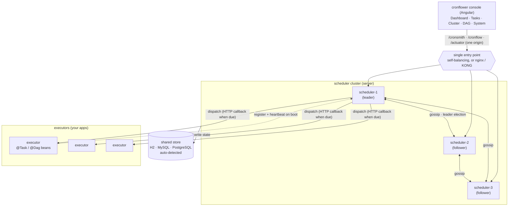
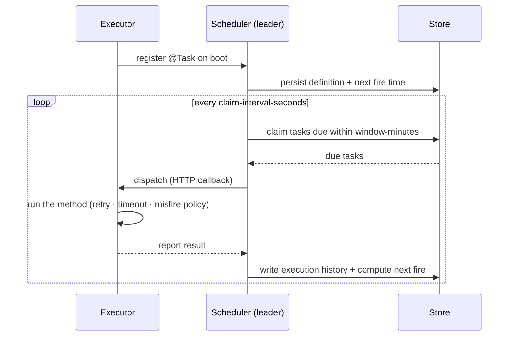
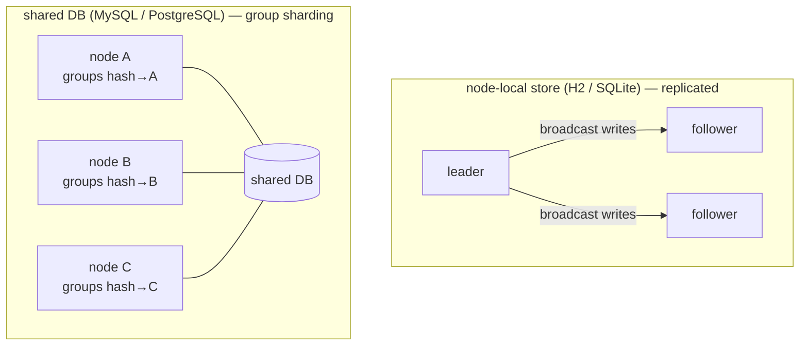
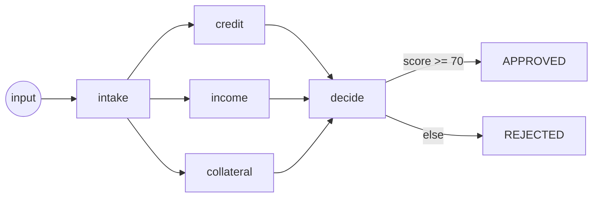

# Architecture

cronflower is a **distributed, stateful cron scheduler** (plus an optional DAG add-on). Responsibility
is split three ways: the **scheduler** owns the schedule and the durable state, **executors** own the
business code, and the **console** is the operator's window onto both.

## System topology

The leader schedules and dispatches; followers serve reads and take over on failover. The console
talks to **one** endpoint — any node answers reads locally and routes writes to the leader.

## Task lifecycle

A `@Task` on an executor becomes a durable definition the scheduler owns; the leader claims it when
due and calls back. Nothing lives only in memory, so a restart or failover loses nothing.

**Windowed loading** is what lets it scale: only tasks due within `window-minutes` are held in memory,
the rest stay in the store and are claimed as they come due, so a cluster with hundreds of thousands
of tasks still starts instantly.

## Store & sharding topology

The store is auto-detected from the JDBC connection. A **node-local** store is replicated by the
leader; a **shared** database additionally unlocks **group sharding**, where each node fires only the
task groups that hash to it.

**Weighted dispatch** routes runs to executors by capacity; routing is configurable
(`cronsmith.server.dispatch.routing`: round-robin / weighted / consistent-hash / random / first / last).

## DAG orchestration (cronflow)

The optional `cronflow` add-on turns the same cluster into a workflow engine. A `@Dag` is a graph of
`@DagNode` steps; the engine drives the graph across the cluster, dispatching each node to a live
executor, with data flowing between nodes over typed **channels** (each with a reducer).

Edges are not just straight lines: `when` routes by a SpEL expression, `trigger = ALL/ANY` sets the
join mode, `subgraph` nests a whole other DAG, and `@Shard` fans a node out once per list element at
run time. A workflow is triggered by hand, from a finished `@Task`, or on a schedule.

## YCRON (year-based extension)

Traditional cron cannot express "the 200th day of the year" or "the first ISO week". YCRON adds a
year-scoped syntax — fields `‹sec› ‹min› ‹hour› ‹dow› ‹woy› ‹doy› ‹year›` — fully isolated from the
traditional parser. Pick it per task with `@Task(parser = "ycron")` (or the console's Syntax
selector). The engine still prefers traditional cron whenever a schedule *can* be expressed that way.

## Persistence & serialization

Task schedules are stored as a compact binary that fully reconstructs the expression tree (including
its `CronType`, so cron vs. YCRON survives a round-trip). The `cron_expression` binary column is the
source of truth; a human-readable `cron` string is kept alongside for display.

## Components at a glance

| Layer | Module | Responsibility |
|-------|--------|----------------|
| Scheduler | `cronsmith-spring-boot-starter` → `cronflow-server-api` | owns schedules & durable state; leader election, windowed loading, dispatch, sharding |
| Executor | `cronsmith-executor-spring-boot-starter` → `cronflow-executor-example` | hosts `@Task` / `@Dag` beans; registers on boot; runs the code on callback |
| DAG add-on | `cronflow-spring-boot-starter` / `cronflow-executor-spring-boot-starter` | graph orchestration over the same cluster |
| Console | `cronflower/frontend` | Angular standalone + signals; one endpoint; live cluster / tasks / DAG / settings |
