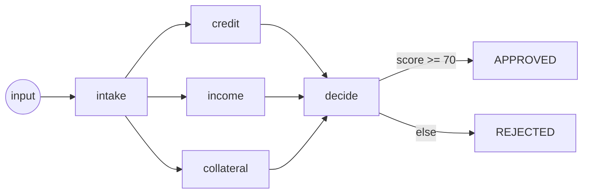

# cronflower：在集群上跑一张 DAG 工作流，别再手动串 cron 任务了

**cronflower** 是一个面向 JVM、自带控制台的开源分布式调度器。`cronflow` 是它可选的 DAG 附加组件：把「有哪些步骤、彼此怎么依赖」声明成一张图，同一个集群按图逐个节点地跑，数据在节点间通过类型化 channel 流转。（它的分布式 `@Task` 调度另有[一篇](../cronsmith/distributed-task-scheduling.zh.md)。）


## 它解决什么问题？

团队最后都会去手动串 cron：一个 02:00 给订单扣款，另一个 02:15 发货，之所以晚 15 分钟，是赌第一个**通常**能在之前跑完。两者没有真正的依赖、没有共享数据，事后也无从判断：第二步跑起来，是因为第一步真的成功了，还是仅仅因为时钟到点了。

这就是纯 cron 撞上的墙：它只能调度单个任务，编排不了一连串任务的流转。一张 DAG 让依赖变成真的，让数据在步骤间流动，并且每次运行都留痕。

## 快速开始

```bash
git clone https://github.com/paganini2008/cronflower
cd cronflower/deploy
./run-local.sh -e 1          # 调度器 + 控制台 + 1 个执行器
```

打开 <http://localhost:7200>（`admin` / `admin123`），示例 DAG 已经注册在 **DAG > Workflows** 下，随时可触发。

## 环境要求

| 需要 | 版本 / 说明 |
|------|-------------|
| JDK | 17+（用自带的 Maven Wrapper 构建） |
| Node | 20+（构建控制台） |
| cronflow 附加组件 | 调度器加 `cronflow-spring-boot-starter`，执行器加 `cronflow-executor-spring-boot-starter` |
| 数据库 | 可选，不配就是内嵌 H2；配 MySQL / PostgreSQL 得到共享存储 |

## 工作原理

一个 DAG 就是一个 Spring bean：`@Dag` 给它命名，每个 `@DagNode` 方法是一个步骤，`to` 列表就是边。节点返回一个「命名 channel 写入」的 `Map`，下游节点从 `DagState` 读。每个 `@Channel` 声明并发写入怎么通过 **reducer** 合并。引擎把图**跨整个集群**驱动，把每个节点派发给一个存活的执行器。



## 代码示例

### 声明一个工作流 `@Dag`

**输入**：一个带 `@Dag` + `@DagNode` 方法和类型化 channel 的 bean：

```java
@Dag(name = "scoring-flow", inputs = {"input"}, channels = {
        @Channel(name = "score",   reducer = ChannelReducer.SUM_INT),
        @Channel(name = "factors", reducer = ChannelReducer.JOIN_CSV)})
@Component
public class ScoringFlow {

    @DagNode(entry = true, to = {"credit", "income", "collateral"})     // 扇出到三个并行打分节点
    public Map<String, Object> intake(DagState state) {
        return Map.of("applicant", state.getString("input"));
    }

    @DagNode(to = {"decide"})
    public Map<String, Object> credit(DagState state) {
        return Map.of("score", 40, "factors", "credit");
    }
    // income()、collateral() … 形状相同，写入同样的 channel

    @DagNode(trigger = "ALL")                                           // 汇合：等全部三个到齐
    public Map<String, Object> decide(DagState state) {
        long total = state.getLong("score");                           // reducer 已经求和好了
        return Map.of("decision", total >= 70 ? "APPROVED" : "REJECTED");
    }
}
```

**执行**：三个打分节点并行跑，各自写 `score`；reducer 把并发写入合并（求和成 90），于是 `decide` 读到一个合并好的单值。没有共享可变状态，也不用假设谁先谁后。

**输出**：控制台把图画出来；一次运行逐个节点亮起，每个节点都显示**由哪个执行器跑的**，所以宽扇出是真的在不同机器上并行：


### 边不只是直线

```java
@DagNode(when = @When(expr = "#risk > 80", to = "humanReview"), otherwise = {"fulfilment"})
public Map<String, Object> riskScore(DagState state) { /* 写入 risk */ }

@DagNode(subgraph = "fulfilment-flow", to = {"notify"})                // 嵌套一整张 DAG
public Map<String, Object> fulfilment(DagState state) { /* ... */ }

@DagNode(shard = @Shard(input = "ids", output = "squares"), to = {"report"})
public Map<String, Object> square(DagState state) { /* 运行时每个 id 跑一次 */ }
```

- **`when` + `otherwise`**：用 SpEL 表达式按 channel 里的数据决定下一步。
- **`trigger`**：`ALL` 等所有上游边到齐；`ANY` 第一个到就触发。
- **`subgraph`**：一个节点就是另一整张 DAG，于是组合而非复制。
- **`@Shard`**：动态扇出，按运行时才知道的列表逐元素各跑一次。

### 三种触发方式

- **手动**，用控制台的 *Trigger* 按钮，可选传一段 JSON 作为输入 channel 的种子。
- **由同一个 bean 里完成的 `@Task` 触发**：它的返回值就是 DAG 的输入。
- **直接按排期触发**：在 *Create Task* 表单里选 *Trigger DAG*。


## 配置：channel 与 reducer

每个 `@Channel` 用内置 reducer 合并并发写入，或用 `customReducer` 指向你自己的：

| Reducer | 合并方式 |
|---------|----------|
| `SUM_INT` / `SUM_LONG` | 数值相加 |
| `MAX` / `MIN` | 取最大 / 最小 |
| `AND` / `OR` | 布尔折叠 |
| `CONCAT_LIST` / `UNION_SET` | 追加 / 并集 |
| `CONCAT_STRING` / `JOIN_CSV` | 文本拼接 |
| `MERGE_MAP` | 合并 map |
| `LAST_WINS` / `FIRST_WINS` / `WRITE_ONCE` | 只取一个写入者 |

执行器用 `cronflow.client.server-urls` 指向调度器；服务端前缀是 `cronflow.server.api-prefix`（默认 `/cronflow`）。

## 局限与取舍

- DAG 引擎跑在**cronflow 附加组件**之上、依托调度器集群，不是独立的工作流服务器。先把 cronflower 跑起来，再加 `@Dag` bean。
- 节点通过 HTTP 派发给执行器，所以节点的 bean 要**可达、且足够幂等**以便重试。
- channel 的值要跨网络在节点间传递，所以保持**可序列化、体量别太大**。
- 它编排的是**你的步骤**，不是用来流式处理大数据集的数据管道引擎。

## 小结

- 一个 DAG 就是一个 Spring bean：**`@Dag` + `@DagNode`**，`to` 定义边，数据走类型化 **channel**。
- **reducer** 合并并发写入，汇合不需要锁、也不用假设先后。
- **分支**（`when`）、**汇合模式**（`ALL`/`ANY`）、**子图**、**动态扇出**（`@Shard`）都是注解属性。
- 引擎把**图跨集群驱动**，每个节点派发给一个存活的执行器。
- 触发方式：**手动、由完成的任务、或按排期**。
- 每次运行都**逐节点留痕**，看得到什么在哪跑的、产出了什么。

把它跑起来：[cronflower on GitHub](https://github.com/paganini2008/cronflower)。
