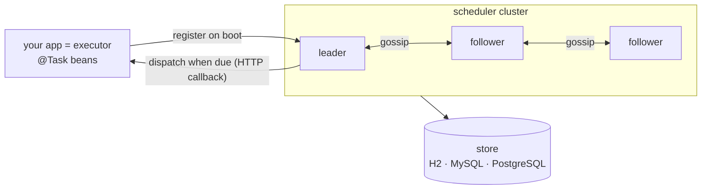

# cronflower: turn a Spring Boot app into a distributed cron cluster

**cronflower** is an open-source, distributed cron scheduler for the JVM with a web console. It forms
its own cluster and needs no external database, broker, or coordinator. This post is the usage tour of
its distributed **task** scheduling (its DAG side has [its own post](../cronflower/dag-workflow-orchestration.en.html)).


## What problem does it solve?

`@Scheduled` runs in one JVM, so the moment you scale to two instances the job fires twice. It has no
retry, no timeout, no history, and no view of what ran; if the box reboots at 02:00 the nightly rollup
just quietly doesn't happen.

The usual fix is to bolt on Quartz, a database, a lock table, and a dashboard you wrote yourself.
cronflower is that whole stack behind two dependencies: you annotate a method, run the scheduler
alongside it, and get a clustered, persistent, retrying scheduler with a console.

## Quick start

```bash
git clone https://github.com/paganini2008/cronflower
cd cronflower/deploy
./run-local.sh -e 1          # scheduler + console + 1 executor  (embedded H2)
```

Open <http://localhost:7200>, sign in `admin` / `admin123`, and the example tasks are already running.
Scale into a real cluster with `./run-local.sh -n 3 -e 2`.

## Requirements

| Need | Version / note |
|------|----------------|
| JDK | 17+ (builds via the bundled Maven Wrapper) |
| Node | 20+ (builds the console) |
| Docker | optional (container path only) |
| Database | optional — none → embedded H2; MySQL / PostgreSQL for a shared store |

## How it works

Two kinds of process: a **scheduler** owns the schedule and durable state; an **executor** is your app,
which declares tasks and runs the code on callback. Run several schedulers and they elect a leader over
gossip; state lives in the store, so a restart or failover loses nothing.



The leader loads only the tasks due in the next few minutes into a timing wheel and claims the rest
from the store as they come due, so a cluster with hundreds of thousands of tasks still starts
instantly.


## Code examples

### A task is a `@Task` bean method

**Input** — annotate a method on an executor (0 args, or a single `String` parameter):

```java
@Component
public class DemoTasks {

    @Task(cron = "*/5 * * * * ?", group = "showcase", name = "sayHello", initialParameter = "world")
    public String sayHello(String who) { return "hello, " + who; }

    // Fixed interval, no cron. Or iso = "PT1H30M" for an ISO-8601 duration.
    @Task(interval = 10, intervalUnit = TimeUnit.SECONDS, group = "showcase", name = "every10s")
    public void every10s() { /* ... */ }

    // YCRON: noon on the 200th day of the year — no classic cron can say this.
    @Task(cron = "0 0 12 ? ? 200", parser = "ycron", group = "showcase", name = "dayOfYear200")
    public void dayOfYear200() { /* ... */ }
}
```

**Execution** — discovered on boot, registered with the scheduler, which owns the schedule from then on.

**Output** — each task shows up in the console with its schedule, run count, and next fire time.

### Reliability is configured, not coded

**Input** — add attributes; the **scheduler** enforces them, so every executor behaves the same:

```java
@Task(cron = "*/20 * * * * ?", group = "reliability", name = "flaky",
      maxRetryCount = 2, retryInterval = 1000,   // retry with back-off
      timeout = 2000,                            // fail a run that overruns 2s
      misfirePolicy = "SKIP",                    // FIRE_ONCE_NOW (default) / FIRE_ALL / SKIP
      repeatCount = 10)                          // finish after 10 fires
public String flaky(String parameter) { /* fails twice, then succeeds */ }
```

**Output** — in the execution history a single fire is three rows (attempt `#0` fail, `#1` fail, `#2`
success), each tagged with the scheduler that dispatched it and the executor that ran it:


### Build a schedule in code, or skip the executor

```java
// Fluent, self-validating schedule instead of a hand-typed string:
@Bean CronExpressionBuilder mondayMornings() {
    return () -> new CronBuilder().everyWeek().Mon().at(9, 0).toString();
}
@Task(builder = "mondayMornings", description = "weekly report")
public void weeklyReport() { /* ... */ }
```

For a job that is just "call this URL on a schedule", create an **HTTP-API task** from the console's
*New task* form or the REST API — the scheduler makes the call itself, no executor involved, and
operators add or edit tasks with no redeploy.

The `@Task` attributes, for reference:

| Attribute | What it does |
|-----------|--------------|
| `cron` / `parser` | a cron schedule, or YCRON with `parser = "ycron"` |
| `interval` + `intervalUnit` / `iso` | a fixed interval, or an ISO-8601 duration |
| `builder` | a `CronExpressionBuilder` bean (wins over `cron`; the only way to set a deadline) |
| `initialParameter` | a constant, or a SpEL template evaluated on each fire |
| `maxRetryCount` / `retryInterval` | retry a failed run, with back-off |
| `timeout` | fail a run that overruns, in milliseconds |
| `misfirePolicy` | `FIRE_ONCE_NOW` (default) / `FIRE_ALL` / `SKIP` |
| `repeatCount` | total fires before the task finishes |

## Configuration

| Property | Default | Description |
|----------|---------|-------------|
| `cronsmith.client.server-urls` | — | On the executor: scheduler seed URL(s) |
| `cronsmith.server.scheduler.zone` | `UTC` | Fire-time zone — must match cluster-wide |
| `cronsmith.server.scheduler.window-minutes` | `5` | Windowed-loading horizon |
| `cronsmith.server.scheduler.sharding` | `true` | Group sharding over a shared store (else leader-only) |
| `cronsmith.server.dispatch.routing` | `ROUND_ROBIN` | …`WEIGHTED` / `CONSISTENT_HASH` / `RANDOM` / `FIRST` / `LAST` |
| `spring.datasource.url` | H2 file | Point at MySQL/PostgreSQL for a shared, sharding-capable store |

## Limitations & trade-offs

- It is a **platform to run** (its own gossip cluster + store), not a tiny in-process library. For one
  JVM with a couple of fixed jobs, plain `@Scheduled` is lighter.
- **Group sharding** needs a **shared** database (MySQL/PostgreSQL); on node-local H2/SQLite it safely
  degrades to leader-only.
- Fire-time **zone must match across nodes**; everything is computed and stored in UTC.
- Bean tasks run on executors, so the scheduler reaches them over HTTP — they must be reachable from it.

## Summary

- A distributed, stateful cron scheduler for Spring Boot, **two dependencies**, no external infra.
- Nodes **gossip and elect a leader**; a restart or failover loses nothing, and no cron fires twice.
- `@Task` gives you cron / **YCRON** / interval / ISO-8601, plus retry, timeout, misfire, repeat — declarative.
- **HTTP-API tasks** need no executor; operators add or edit tasks with no redeploy.
- Every run is **recorded** with result, timing, attempt, and the node that ran it.
- **Group sharding** + **weighted dispatch** scale it horizontally; a timing wheel + windowed loading keep startup instant.
- A **console** shows tasks, cluster, executors, health, and live settings from one endpoint.

Run it: [cronflower on GitHub](https://github.com/paganini2008/cronflower).
