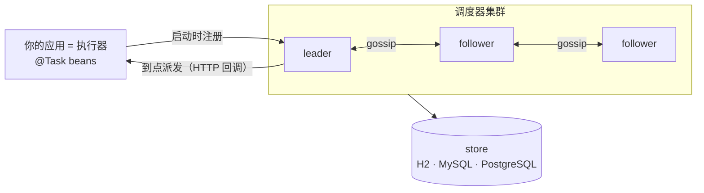

# cronflower：把 Spring Boot 变成一个分布式定时任务集群

**cronflower** 是一个面向 JVM、自带控制台的开源分布式定时任务调度器。它自己组建集群，不依赖任何外部数据库、消息队列或协调服务。这篇讲它的分布式**任务**调度。


## 它解决什么问题？

`@Scheduled` 只在一个 JVM 里跑，所以你一扩容到两个实例，任务就触发两次。它没有重试、没有超时、没有运行记录，也看不到跑过什么；机器要是凌晨 2 点重启，那个夜间汇总就悄无声息地没跑。

常规解法是自己拼上 Quartz、一个数据库、一张锁表，外加一个手写看板。cronflower 把这一整套压进两个依赖：给方法加个注解、把调度器跟它一起跑，你就得到一个集群化、可持久化、会重试、带控制台的调度器。

## 快速开始

```bash
git clone https://github.com/paganini2008/cronflower
cd cronflower/deploy
./run-local.sh -e 1          # 调度器 + 控制台 + 1 个执行器（内嵌 H2）
```

打开 <http://localhost:7200>，用 `admin` / `admin123` 登录，示例任务已经在跑。想变成真正的集群，用 `./run-local.sh -n 3 -e 2`。

## 环境要求

| 需要 | 版本 / 说明 |
|------|-------------|
| JDK | 17+（用自带的 Maven Wrapper 构建） |
| Node | 20+（构建控制台） |
| Docker | 可选（仅容器方式） |
| 数据库 | 可选，不配就是内嵌 H2；配 MySQL / PostgreSQL 得到共享存储 |

## 工作原理

进程分两类：**调度器**掌管排期与持久状态；**执行器**是你的应用，声明任务、到点被回调执行。跑多个调度器，它们通过 gossip 选出 leader；状态存在 store 里，重启或故障转移都不丢。



leader 只把接下来几分钟到点的任务加载进时间轮，其余留在 store 里到点再认领，所以几十万任务的集群依然秒起。


## 代码示例

### 任务就是一个 `@Task` bean 方法

**输入**：在执行器上给方法加注解（无参，或带一个 `String` 参数）：

```java
@Component
public class DemoTasks {

    @Task(cron = "*/5 * * * * ?", group = "showcase", name = "sayHello", initialParameter = "world")
    public String sayHello(String who) { return "hello, " + who; }

    // 固定间隔，不用写 cron。或 iso = "PT1H30M" 用 ISO-8601 时长。
    @Task(interval = 10, intervalUnit = TimeUnit.SECONDS, group = "showcase", name = "every10s")
    public void every10s() { /* ... */ }

    // YCRON：一年第 200 天的中午，月制 cron 说不出来。
    @Task(cron = "0 0 12 ? ? 200", parser = "ycron", group = "showcase", name = "dayOfYear200")
    public void dayOfYear200() { /* ... */ }
}
```

**执行**：启动时被发现、注册到调度器，之后排期归调度器管。

**输出**：每个任务出现在控制台里，带排期、运行次数、下次触发时间。

### 可靠性是配出来的，不是写出来的

**输入**：加几个属性，由**调度器**统一执行，于是每个执行器行为一致：

```java
@Task(cron = "*/20 * * * * ?", group = "reliability", name = "flaky",
      maxRetryCount = 2, retryInterval = 1000,   // 带退避的重试
      timeout = 2000,                            // 超过 2 秒判超时
      misfirePolicy = "SKIP",                    // FIRE_ONCE_NOW（默认）/ FIRE_ALL / SKIP
      repeatCount = 10)                          // 跑 10 次后结束
public String flaky(String parameter) { /* 前两次失败，第三次成功 */ }
```

**输出**：执行历史里这一次触发是三行（尝试 `#0` 失败、`#1` 失败、`#2` 成功），每行都标明是哪个调度节点派发、哪个执行器跑的：


### 用代码构建排期，或者干脆不用执行器

```java
// 用流式、自校验的方式构建排期，取代易错的手写字符串：
@Bean CronExpressionBuilder mondayMornings() {
    return () -> new CronBuilder().everyWeek().Mon().at(9, 0).toString();
}
@Task(builder = "mondayMornings", description = "weekly report")
public void weeklyReport() { /* ... */ }
```

对于「按点调一个 URL」这种活儿，在控制台 *New task* 表单或 REST API 里建一个 **HTTP-API 任务**，调度器自己发起调用，不涉及任何执行器，运维也能不重新部署就加/改任务。

`@Task` 属性速查：

| 属性 | 作用 |
|------|------|
| `cron` / `parser` | cron 排期，或加 `parser = "ycron"` 用 YCRON |
| `interval` + `intervalUnit` / `iso` | 固定间隔，或 ISO-8601 时长 |
| `builder` | 一个 `CronExpressionBuilder` bean（优先于 `cron`；设截止时刻的唯一途径） |
| `initialParameter` | 常量，或每次触发求值的 SpEL 模板 |
| `maxRetryCount` / `retryInterval` | 失败重试，带退避 |
| `timeout` | 超时判定（毫秒） |
| `misfirePolicy` | `FIRE_ONCE_NOW`（默认）/ `FIRE_ALL` / `SKIP` |
| `repeatCount` | 结束前的总触发次数 |

## 配置

| 属性 | 默认 | 说明 |
|------|------|------|
| `cronsmith.client.server-urls` |: | 执行器上：调度器种子 URL |
| `cronsmith.server.scheduler.zone` | `UTC` | 触发时区，必须全集群一致 |
| `cronsmith.server.scheduler.window-minutes` | `5` | 窗口加载视野 |
| `cronsmith.server.scheduler.sharding` | `true` | 共享库上的分组分片（否则 leader-only） |
| `cronsmith.server.dispatch.routing` | `ROUND_ROBIN` | …`WEIGHTED` / `CONSISTENT_HASH` / `RANDOM` / `FIRST` / `LAST` |
| `spring.datasource.url` | H2 文件 | 指向 MySQL/PostgreSQL 得到共享、可分片的存储 |

## 局限与取舍

- 它是**一个要跑起来的平台**（自带 gossip 集群 + store），不是一个进程内小库。单 JVM 加几个固定任务，纯 `@Scheduled` 更轻。
- **分组分片**需要**共享**数据库（MySQL/PostgreSQL）；在节点本地 H2/SQLite 上会安全退回 leader-only。
- 触发**时区必须全集群一致**，一切按 UTC 计算与存储。
- bean 任务跑在执行器上，调度器通过 HTTP 回调它们，所以执行器必须对调度器可达。

## 小结

- 面向 Spring Boot 的分布式有状态调度器，**两个依赖**，零外部基础设施。
- 节点**gossip 选主**，重启/故障转移不丢数据，也没有 cron 触发两次。
- `@Task` 给你 cron / **YCRON** / 间隔 / ISO-8601，外加重试、超时、misfire、repeat，全是声明式。
- **HTTP-API 任务**不需要执行器；运维不重新部署就能加/改任务。
- 每次运行都**留痕**：结果、耗时、尝试次数、由哪个节点运行。
- **分组分片** + **加权派发**横向扩展；时间轮 + 窗口加载让启动始终很快。
- 一个**控制台**，从单一入口看任务、集群、执行器、健康、以及在线配置。

把它跑起来：[cronflower on GitHub](https://github.com/paganini2008/cronflower)。
